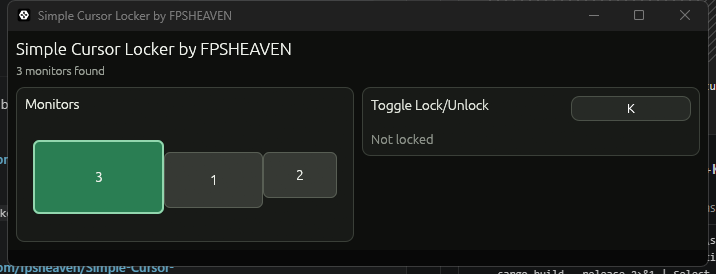

# Simple Cursor Locker by FPSHEAVEN

A compact Windows Rust utility that detects your monitors and can confine the mouse cursor to one selected monitor. The UI is built with egui and the cursor lock/global binds use native Win32 calls.



## Build

```powershell
cargo build --release
```

The optimized app is written to:

```text
target\release\screen_locker.exe
```

## Usage

1. Open `target\release\screen_locker.exe`.
2. Pick a monitor from the layout.
3. Press `Lock Cursor`.
4. Click the toggle bind button to record a new shortcut.

The editable toggle bind is polled without reserving the key, so the shortcut still reaches Windows and the foreground app. Single-key binds are allowed, but they will toggle the lock whenever that key is pressed.

Default binds:

- Toggle lock: `Ctrl+Alt+L`
- Emergency unlock: `Ctrl+Alt+Esc` when Windows allows the app to register it.

`Ctrl+Alt+Esc` is the only reserved Windows hotkey. If another app owns it, Simple Cursor Locker refuses to lock unless the toggle bind is active.

Use the toggle bind or emergency unlock before interacting outside the locked monitor.

Settings are saved to:

```text
%LOCALAPPDATA%\screen_locker\settings.ini
```

The app unregisters hotkeys and releases the cursor lock when it closes.

Build and run in one command:

```powershell
cargo build --release; .\target\release\screen_locker.exe
```
